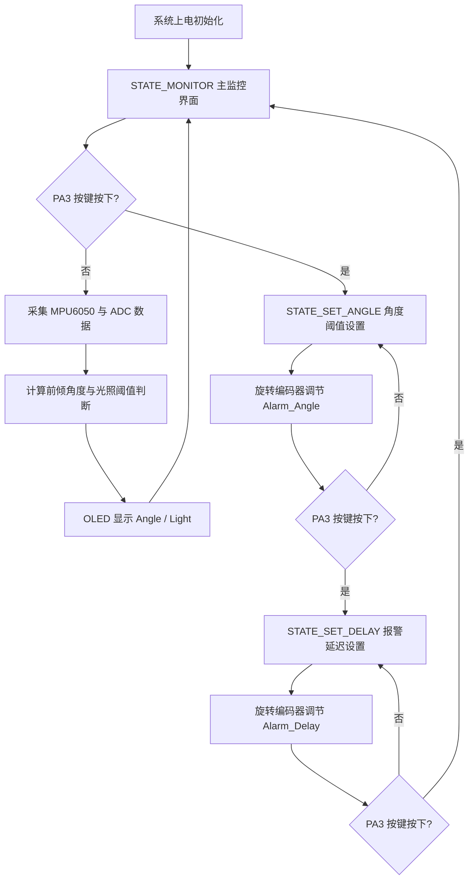

# 智能坐姿与学习环境监测系统课程研究论文大纲

## 题目

基于 STM32F103C8T6 的智能坐姿与学习环境监测系统设计

## 摘要拟写要点

本文设计一种面向学生学习场景的智能坐姿与学习环境监测系统。系统以 STM32F103C8T6 为主控芯片，利用 MPU6050 采集姿态信息，通过光敏电阻采集环境光照强度，并使用 OLED 实时显示坐姿角度、光照强度和报警阈值。系统通过旋转编码器实现人机交互，可设置坐姿报警角度和报警延迟时间。当检测到前倾角度超过设定阈值并持续一定时间时，蜂鸣器发出提示；当环境光照不足时，LED 进行视觉提醒。实验结果表明，该系统具有结构简单、成本较低、交互直观、可扩展性强等特点，能够满足课程设计中对姿态监测、环境感知和本地报警的基本要求。

关键词：STM32F103C8T6；MPU6050；OLED；光敏电阻；旋转编码器；坐姿监测

---

## 插图规划

### 图 1 系统总体架构与信号流程图

用途：放在“方案选择与可行性论证”章节，说明传感器、主控、显示、交互与报警输出之间的关系。

建议使用 image2.0 生成科研风格插图，提示词如下：

```text
Use case: scientific-educational
Asset type: research paper figure
Primary request: Create a clean scientific block diagram for an STM32F103C8T6 based intelligent sitting posture and study environment monitoring system.
Subject: central STM32F103C8T6 microcontroller connected to MPU6050 posture sensor, photoresistor ADC light sensor, rotary encoder with push button, OLED display, active buzzer, and warning LED.
Composition/framing: landscape technical diagram, left-to-right signal flow, sensors on the left, STM32 controller in the center, display and alarm outputs on the right, user interaction module below.
Style/medium: modern academic engineering diagram, flat vector-like infographic, white background, thin blue and gray lines, clear module boxes, arrow labels.
Text labels: "MPU6050", "Photoresistor ADC", "Rotary Encoder", "STM32F103C8T6", "OLED Display", "Buzzer Alarm", "Warning LED", "Threshold Setting", "Posture Angle", "Light Intensity".
Constraints: no decorative 3D effects, no cartoon style, no watermark, no brand logo, keep labels readable, high contrast.
```

### 图 2 软件状态机流程图

用途：放在“单元电路的设计、参数计算和元器件选择”或软件设计小节，说明三状态菜单交互逻辑。

建议绘制内容：



### 图 3 硬件接线布局示意图

用途：放在“单元电路的设计、参数计算和元器件选择”章节，说明各模块引脚连接。

建议绘制内容：以 STM32F103C8T6 最小系统板为中心，周围连接 OLED、MPU6050、光敏电阻、旋转编码器、蜂鸣器和 LED，并标注 PB8/PB9、PB10/PB11、PA0、PA1/PA2/PA3、PB12、PB13。

---

# ① 系统的设计要求与技术指标的确定

## 1.1 课题背景与研究意义

1. 学习场景中长时间伏案容易出现坐姿不良、前倾过度等问题。
2. 不良坐姿可能造成颈椎、腰椎疲劳，影响学习效率和身体健康。
3. 环境光照不足会增加视觉疲劳，因此学习环境监测应同时考虑坐姿和光照。
4. 采用 STM32 单片机实现本地实时监测，具有成本低、响应快、便于课程设计实现的特点。

## 1.2 系统总体设计目标

1. 实时采集人体或座椅姿态变化，计算前倾角度。
2. 实时采集环境光照强度，并在 OLED 上显示 ADC 数值。
3. 用户可以通过旋转编码器调节坐姿报警角度阈值和报警延迟时间。
4. 当前倾角度超过阈值并持续超过设定延迟时，蜂鸣器报警。
5. 当光照 ADC 值低于阈值时，警示 LED 点亮。
6. 系统应具有简单直观的人机交互界面。

## 1.3 系统功能要求

1. 姿态检测功能：通过 MPU6050 采集三轴加速度数据，计算前倾角度。
2. 光照检测功能：通过光敏电阻模块输出模拟电压，STM32 ADC 采样得到光照强度。
3. OLED 显示功能：显示 Angle、Light、Alarm_Angle、Alarm_Delay 等关键参数。
4. 参数设置功能：通过旋转编码器调节报警角度和报警延迟。
5. 声光报警功能：蜂鸣器用于坐姿报警，LED 用于光照不足提醒。
6. 状态机控制功能：主程序采用三状态 FSM，包括主监控、角度设置、延迟设置。

## 1.4 技术指标

| 指标项目 | 设计指标 |
| --- | --- |
| 主控芯片 | STM32F103C8T6 |
| 工作电压 | 3.3 V 为主，部分模块可兼容 5 V |
| 姿态传感器 | MPU6050 三轴加速度计和陀螺仪 |
| 显示模块 | 0.96 寸 I2C OLED |
| 光照采集 | PA0，ADC1_IN0，12 位 ADC，范围 0-4095 |
| 参数输入 | 旋转编码器 A/B 相和按键 |
| 坐姿角度范围 | 0-90° |
| 默认报警角度 | 25° |
| 报警角度可调范围 | 0-90° |
| 默认报警延迟 | 3 s |
| 报警延迟可调范围 | 1-10 s |
| 蜂鸣器输出 | PB12，低电平触发 |
| LED 输出 | PB13，低电平点亮 |
| 软件开发环境 | Keil MDK，STM32 标准库，C 语言 |

## 1.5 系统约束条件

1. 不使用复杂操作系统，采用裸机循环加状态机结构。
2. 底层驱动基于 STM32 标准库和课程已有模块代码。
3. 硬件模块应尽量选用常见低成本模块，便于学生搭建。
4. 程序结构应清晰，便于调试和后续扩展。

---

# ② 方案选择与可行性论证

## 2.1 主控方案选择

### 方案一：使用 51 单片机

优点：
1. 成本低。
2. 教学资料丰富。

不足：
1. 外设资源有限。
2. ADC、I2C、外部中断等功能扩展较繁琐。
3. 对多模块综合应用不够方便。

### 方案二：使用 Arduino UNO

优点：
1. 上手简单。
2. 模块库丰富。

不足：
1. 工程底层可控性较弱。
2. 与 STM32 标准库课程内容匹配度不高。
3. 课程设计中难以体现 STM32 外设配置能力。

### 方案三：使用 STM32F103C8T6

优点：
1. 具有 ADC、GPIO、EXTI、I2C 等丰富外设资源。
2. 主频和运算能力满足姿态计算和 OLED 刷新需求。
3. 与课程 STM32 标准库开发内容高度一致。
4. 最小系统板成本低，资料丰富。

结论：选择 STM32F103C8T6 作为主控芯片。

## 2.2 姿态检测方案选择

### 方案一：机械倾角开关

优点：电路简单。

不足：只能判断是否倾斜，无法获得连续角度值，精度和可调性较差。

### 方案二：MPU6050 姿态传感器

优点：
1. 可采集三轴加速度和三轴角速度。
2. 可通过加速度数据计算倾角。
3. I2C 接口占用引脚少。
4. 模块成本低、资料丰富。

结论：选用 MPU6050 作为坐姿前倾检测模块。

## 2.3 光照检测方案选择

### 方案一：数字光敏模块 DO 输出

优点：直接输出高低电平，程序简单。

不足：只能判断明暗，阈值依赖模块电位器，无法显示连续光照强度。

### 方案二：光敏电阻 AO 模拟输出

优点：
1. 可由 ADC 读取连续数值。
2. 便于 OLED 实时显示。
3. 可在软件中灵活设置阈值。

结论：选择光敏电阻模块 AO 输出接入 STM32 PA0。

## 2.4 显示与交互方案选择

1. 显示模块选用 I2C OLED，原因是显示清晰、功耗低、占用引脚少。
2. 参数输入选用旋转编码器，原因是既能旋转调节数值，又能按下切换状态，适合菜单式交互。

## 2.5 报警输出方案选择

1. 坐姿异常采用有源蜂鸣器提示，声音反馈直观。
2. 光照不足采用 LED 提醒，视觉反馈简单可靠。
3. 两个报警输出均采用低电平有效，便于匹配常见模块。

## 2.6 总体方案可行性分析

1. 硬件可行性：所有模块均为常见教学套件，接线简单，供电要求明确。
2. 软件可行性：标准库驱动已具备 OLED、MPU6050、ADC、编码器等基础模块，应用层只需完成状态机和业务逻辑。
3. 成本可行性：系统由低成本模块组成，适合课程设计。
4. 调试可行性：OLED 可显示实时数据和诊断信息，便于逐步验证。

---

# ③ 单元电路的设计、参数计算和元器件选择

## 3.1 STM32F103C8T6 最小系统

### 3.1.1 元器件选择

1. 主控芯片：STM32F103C8T6。
2. 最小系统板：江科大/江科协 STM32F103C8T6 最小系统板。
3. 下载接口：ST-Link SWD 下载。

### 3.1.2 引脚分配

| 功能模块 | STM32 引脚 |
| --- | --- |
| OLED SCL | PB8 |
| OLED SDA | PB9 |
| MPU6050 SCL | PB10 |
| MPU6050 SDA | PB11 |
| 光敏 AO | PA0 |
| 编码器 A 相 | PA1 |
| 编码器 B 相 | PA2 |
| 编码器按键 SW | PA3 |
| 蜂鸣器 IN | PB12 |
| LED IN | PB13 |
| ST-Link SWDIO | SWDIO |
| ST-Link SWCLK | SWCLK |

## 3.2 OLED 显示电路

### 3.2.1 设计说明

OLED 使用 I2C 通信方式，连接 PB8 和 PB9。显示内容包括主界面实时数据和设置界面参数。

### 3.2.2 接线

| OLED 引脚 | STM32 引脚 |
| --- | --- |
| GND | GND |
| VCC | 3.3V |
| SCL | PB8 |
| SDA | PB9 |

### 3.2.3 设计要点

1. I2C 总线采用开漏输出方式。
2. OLED 驱动兼容常见地址 `0x78` 和 `0x7A`。
3. 显示刷新周期与主循环采样周期一致，约 100 ms。

## 3.3 MPU6050 姿态检测电路

### 3.3.1 元器件选择

选用 MPU6050 模块，其内部集成三轴加速度计和三轴陀螺仪，适合姿态检测。

### 3.3.2 接线

| MPU6050 引脚 | STM32 引脚 |
| --- | --- |
| VCC | 3.3V |
| GND | GND |
| SCL | PB10 |
| SDA | PB11 |

### 3.3.3 地址与通信

MPU6050 常用 I2C 地址为：

```text
AD0 = 0：0xD0
AD0 = 1：0xD2
```

程序中已自动尝试两个地址，提高兼容性。

### 3.3.4 角度计算

系统主要利用加速度计数据估算前倾角：

```text
Angle = atan(|AccX| / sqrt(AccY^2 + AccZ^2)) * 180 / π
```

其中 `AccX` 为当前安装方向下代表前倾变化的轴。若实际安装方向不同，可将计算轴改为 `AccY` 或 `AccZ`。

## 3.4 光敏检测电路

### 3.4.1 元器件选择

选用光敏电阻模块，使用 AO 模拟输出端。

### 3.4.2 接线

| 光敏模块引脚 | STM32 引脚 |
| --- | --- |
| VCC | 3.3V |
| GND | GND |
| AO | PA0 |

### 3.4.3 ADC 参数

STM32F103C8T6 内部 ADC 为 12 位，转换范围：

```text
0 ~ 4095
```

若参考电压为 3.3 V，则 ADC 数值与输入电压关系为：

```text
Vin = ADC_Value / 4095 * 3.3 V
```

例如 ADC 值为 2048 时：

```text
Vin ≈ 2048 / 4095 * 3.3 ≈ 1.65 V
```

## 3.5 旋转编码器输入电路

### 3.5.1 元器件选择

选择带按键的 360 度旋转编码器模块，可同时实现数值调节和菜单切换。

### 3.5.2 接线

| 编码器引脚 | STM32 引脚 |
| --- | --- |
| VCC | 3.3V |
| GND | GND |
| A/CLK | PA1 |
| B/DT | PA2 |
| SW | PA3 |

### 3.5.3 工作方式

1. A 相和 B 相配置为上拉输入。
2. PA1 和 PA2 使用 EXTI 中断检测下降沿。
3. 通过另一相电平判断旋转方向。
4. SW 按键使用软件消抖，按下时进入下一级菜单。

## 3.6 蜂鸣器报警电路

### 3.6.1 元器件选择

选用低电平触发有源蜂鸣器模块。

### 3.6.2 接线

| 蜂鸣器引脚 | STM32 引脚 |
| --- | --- |
| VCC | 3.3V 或 5V |
| GND | GND |
| IN | PB12 |

### 3.6.3 控制逻辑

当角度超过阈值并持续超过设定延迟时：

```text
PB12 = 0，蜂鸣器响
```

否则：

```text
PB12 = 1，蜂鸣器关闭
```

## 3.7 LED 提醒电路

### 3.7.1 元器件选择

选用低电平点亮 LED 模块，或普通 LED 加限流电阻。

### 3.7.2 参数计算

若使用普通 LED，假设：

```text
VCC = 3.3 V
LED 正向压降约 2.0 V
期望电流约 5 mA
```

限流电阻为：

```text
R = (3.3 - 2.0) / 0.005 = 260 Ω
```

实际可选常见阻值：

```text
330 Ω 或 470 Ω
```

### 3.7.3 接线

| LED 引脚 | STM32 引脚 |
| --- | --- |
| VCC | 3.3V |
| GND | GND |
| IN | PB13 |

## 3.8 软件状态机设计

系统采用三状态 FSM：

| 状态 | 功能 |
| --- | --- |
| STATE_MONITOR | 主监控界面，显示角度和光照，并执行报警判断 |
| STATE_SET_ANGLE | 调节角度报警阈值 |
| STATE_SET_DELAY | 调节报警延迟时间 |

状态转换由编码器按键 PA3 触发，参数调节由编码器 A/B 相完成。

## 3.9 系统调试与测试方案

1. OLED 测试：上电显示启动自检字符。
2. MPU6050 测试：读取 WHO_AM_I，正常应为 `0x68`。
3. ADC 测试：遮挡或照射光敏电阻，观察 ADC 数值变化。
4. 编码器测试：旋转编码器，观察累计值变化。
5. 报警测试：改变角度阈值和延迟，验证蜂鸣器响应。
6. 光照测试：改变环境光，验证 LED 提醒逻辑。

---

# ④ 参考资料目录

1. STMicroelectronics. *STM32F103x8/B Datasheet*. STMicroelectronics.
2. STMicroelectronics. *RM0008 Reference Manual: STM32F10xxx Advanced ARM-based 32-bit MCUs*. STMicroelectronics.
3. STMicroelectronics. *STM32F10x Standard Peripheral Library User Manual*. STMicroelectronics.
4. InvenSense. *MPU-6000 and MPU-6050 Product Specification*. InvenSense.
5. InvenSense. *MPU-6000 and MPU-6050 Register Map and Descriptions*. InvenSense.
6. Solomon Systech. *SSD1306 OLED Driver Controller Datasheet*. Solomon Systech.
7. 江科大 STM32 入门教程及配套标准库例程.
8. Keil. *MDK-ARM User Guide*. Arm Keil.
9. 《模拟电子技术基础》相关教材中关于分压电路、限流电阻和传感器接口电路的章节.
10. 《嵌入式系统原理与应用》相关教材中关于 GPIO、ADC、I2C、外部中断和状态机程序设计的章节.

---

# 论文撰写建议

1. 正文可按以上四个一级章节展开，每个一级章节约 2-4 页。
2. 第 ① 部分重点写需求和指标，避免过早进入代码细节。
3. 第 ② 部分重点体现“为什么选 STM32、MPU6050、OLED、光敏 AO、旋转编码器”。
4. 第 ③ 部分是论文主体，应结合原理图、接线表、参数计算和程序流程图说明。
5. 第 ④ 部分按学校格式统一排版，建议引用数据手册、参考手册、课程资料和教材。

