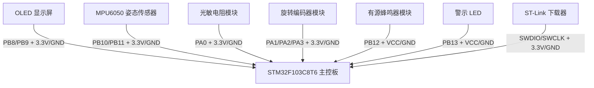

# 智能坐姿与学习环境监测系统：新手逐步接线示意图

本文是给完全没有嵌入式经验的初学者看的接线指南。目标是：按照步骤一根线一根线连接套件，最后能完成编译、下载和运行。

接线前请先断电。接完一部分再上电测试，不要一开始就把所有模块全部接上。

## 1. 图中套件里本项目会用到哪些

根据你提供的“STM32 江科大简配套件”图片，本项目主要用到这些东西：

| 图中套件 | 本项目用途 | 是否必须 |
| --- | --- | --- |
| STM32F103C8T6 最小系统板 | 主控核心，相当于大脑 | 必须 |
| ST-Link 下载器 | 把程序下载到 STM32 | 必须 |
| 0.96 寸 OLED 显示屏 | 显示角度、光照、设置值 | 必须 |
| MPU6050 模块 | 检测坐姿前倾角度 | 必须 |
| 旋转编码器模块 | 调节菜单参数，按下切换界面 | 必须 |
| 光敏电阻模块 | 检测环境光照 | 必须 |
| 有源蜂鸣器模块 | 坐姿异常时报警 | 必须 |
| LED 或 LED 模块 | 光照不足时提醒 | 必须 |
| 面包板 | 临时接线，不用焊接 | 推荐 |
| 面包板电源模块 | 给面包板提供 3.3V/5V | 可选 |
| 杜邦线 | 连接各模块 | 必须 |
| 电阻包 | 普通 LED 限流使用 | 视情况需要 |

图中的数码管、USB 转串口模块、大量彩色普通 LED 不是本项目必须使用的套件。

## 2. 最终连接总览



## 3. 先认识几个名字

### 3.1 STM32 引脚

STM32 板子两侧有很多针脚，丝印一般写着：

```text
PA0 PA1 PA2 PA3 ...
PB8 PB9 PB10 PB11 PB12 PB13 ...
3V3 GND 5V
```

本文里的 `PA0`、`PB8` 这些名字，都是 STM32 板子上的针脚名。

### 3.2 VCC 和 GND

每个模块一般都有：

```text
VCC：接电源正极
GND：接地
```

本项目大多数模块建议接：

```text
VCC -> 3.3V
GND -> GND
```

所有模块的 GND 必须连在一起，这叫“共地”。不共地时，模块很可能完全不工作。

### 3.3 信号线

除了 VCC 和 GND，其他线通常是信号线，例如：

```text
SCL SDA AO A B SW IN
```

信号线必须接到指定 STM32 引脚，不能随便换。

## 4. 第一步：连接 ST-Link 下载器

ST-Link 用来下载程序。先只接 STM32 和 ST-Link。

| ST-Link 引脚 | STM32 引脚 |
| --- | --- |
| SWDIO | SWDIO |
| SWCLK | SWCLK |
| GND | GND |
| 3.3V | 3.3V |

接好后，STM32 可以通过 ST-Link 或 USB 供电。新手建议先用 ST-Link 的 3.3V 给 STM32 供电，线少一些。

如果你的最小系统板没有 `SWDIO`、`SWCLK` 丝印，再找 `PA13`、`PA14`：`SWDIO` 对应 `PA13`，`SWCLK` 对应 `PA14`。

注意：

1. `SWDIO` 和 `SWCLK` 不要接反。
2. `GND` 必须接。
3. 不要把 ST-Link 的 5V 接到 STM32 的 3.3V。

## 5. 第二步：连接 OLED 显示屏

OLED 是第一个建议测试的外设。它接好后，程序运行时应能显示文字。

| OLED 引脚 | STM32 引脚 |
| --- | --- |
| VCC | 3.3V |
| GND | GND |
| SCL | PB8 |
| SDA | PB9 |

接线口诀：

```text
OLED 的 SCL 接 PB8
OLED 的 SDA 接 PB9
OLED 的 VCC 接 3.3V
OLED 的 GND 接 GND
```

## 6. 第三步：连接 MPU6050

MPU6050 用来检测倾斜角度。

| MPU6050 引脚 | STM32 引脚 |
| --- | --- |
| VCC | 3.3V |
| GND | GND |
| SCL | PB10 |
| SDA | PB11 |

注意 OLED 和 MPU6050 都有 `SCL/SDA`，但它们不能接到同一组引脚：

```text
OLED：SCL -> PB8，SDA -> PB9
MPU6050：SCL -> PB10，SDA -> PB11
```

## 7. 第四步：连接光敏电阻模块

光敏模块用来检测环境光照。模块上可能有 `AO` 和 `DO` 两个输出，本项目使用 `AO`。

| 光敏模块引脚 | STM32 引脚 |
| --- | --- |
| VCC | 3.3V |
| GND | GND |
| AO | PA0 |

注意：

1. 必须接 `AO`，不要接 `DO`。
2. PA0 是模拟输入，引脚电压不能超过 3.3V。
3. 用手遮挡光敏电阻时，OLED 上的 Light 数值应发生变化。

## 8. 第五步：连接旋转编码器

旋转编码器用来调节报警角度和报警延迟。它通常有 `CLK/DT/SW` 或 `A/B/SW`。

如果你的模块写的是 `CLK/DT/SW`，可以按下面理解：

```text
CLK = A
DT  = B
SW  = 按键
```

| 编码器引脚 | STM32 引脚 |
| --- | --- |
| VCC | 3.3V |
| GND | GND |
| A 或 CLK | PA1 |
| B 或 DT | PA2 |
| SW | PA3 |

如果旋转方向和你预期相反，可以交换 A 和 B 两根线。

## 9. 第六步：连接有源蜂鸣器

蜂鸣器用于姿态异常报警。本项目程序按“低电平触发”编写。

| 蜂鸣器引脚 | STM32 引脚 |
| --- | --- |
| VCC | 3.3V 或 5V |
| GND | GND |
| IN | PB12 |

注意：

1. 必须使用“有源蜂鸣器模块”，不是裸蜂鸣片。
2. 如果你的蜂鸣器模块是高电平触发，需要修改程序里的 `Set_Buzzer()`。
3. 初次测试时可以先不接蜂鸣器，避免误报警太吵。

## 10. 第七步：连接警示 LED

LED 用于光照不足提醒。

如果你使用 LED 模块：

| LED 模块引脚 | STM32 引脚 |
| --- | --- |
| VCC | 3.3V |
| GND | GND |
| IN | PB13 |

如果你使用普通 LED：

```text
PB13 -> 限流电阻 -> LED -> 3.3V
```

因为当前程序是低电平点亮，所以推荐接法是：

```text
3.3V -> 电阻 -> LED 正极
LED 负极 -> PB13
```

电阻建议使用：

```text
220 欧 到 1k 欧
```

不要把普通 LED 直接接在电源和引脚之间，必须串联电阻。

## 11. 完整接线表

| 模块 | 模块引脚 | STM32 引脚 |
| --- | --- | --- |
| OLED | VCC | 3.3V |
| OLED | GND | GND |
| OLED | SCL | PB8 |
| OLED | SDA | PB9 |
| MPU6050 | VCC | 3.3V |
| MPU6050 | GND | GND |
| MPU6050 | SCL | PB10 |
| MPU6050 | SDA | PB11 |
| 光敏模块 | VCC | 3.3V |
| 光敏模块 | GND | GND |
| 光敏模块 | AO | PA0 |
| 编码器 | VCC | 3.3V |
| 编码器 | GND | GND |
| 编码器 | A/CLK | PA1 |
| 编码器 | B/DT | PA2 |
| 编码器 | SW | PA3 |
| 蜂鸣器 | VCC | 3.3V 或 5V |
| 蜂鸣器 | GND | GND |
| 蜂鸣器 | IN | PB12 |
| LED 模块 | VCC | 3.3V |
| LED 模块 | GND | GND |
| LED 模块 | IN | PB13 |
| ST-Link | SWDIO | SWDIO，或 PA13 |
| ST-Link | SWCLK | SWCLK，或 PA14 |
| ST-Link | GND | GND |
| ST-Link | 3.3V | 3.3V |

## 12. 建议的实际接线顺序

按这个顺序连接，出问题时最容易定位：

1. 接 STM32 和 ST-Link，确认 Keil 能识别芯片。
2. 接 OLED，下载程序后确认屏幕有显示。
3. 接 MPU6050，晃动模块确认角度变化。
4. 接光敏模块，用手遮挡确认 Light 数值变化。
5. 接旋转编码器，确认能切换菜单和调节数值。
6. 接 LED，确认光线不足时会点亮。
7. 最后接蜂鸣器，确认角度超限并持续一段时间后会报警。

## 13. 面包板怎么用

如果你使用图片中的面包板，可以这样接：

1. 面包板红色长排接 STM32 的 `3.3V`。
2. 面包板蓝色长排接 STM32 的 `GND`。
3. 所有模块的 `VCC` 都接到红色长排。
4. 所有模块的 `GND` 都接到蓝色长排。
5. 每个模块的信号线单独接到 STM32 对应引脚。

这样可以减少 STM32 上 3.3V 和 GND 插不下的问题。

注意：有些面包板中间断开，左右两段电源轨并不连通。如果一侧模块没电，需要用杜邦线把两段红色电源轨连起来、两段蓝色地线轨连起来。

## 14. 上电前检查清单

上电前逐项检查：

1. 有没有把 5V 接到 3.3V。
2. 所有模块 GND 是否都接在一起。
3. OLED 是否接到 PB8/PB9。
4. MPU6050 是否接到 PB10/PB11。
5. 光敏模块是否使用 AO，而不是 DO。
6. 编码器 A/B/SW 是否接到 PA1/PA2/PA3。
7. ST-Link 是否接到 SWDIO/SWCLK；如果板子没有这两个丝印，再检查是否接到 PA13/PA14。
8. 普通 LED 是否串联了电阻。
9. 有没有松动的杜邦线。
10. 有没有金属物导致短路。

## 15. 常见错误

### 15.1 OLED 没有显示

检查：

1. VCC/GND 是否接反。
2. SCL/SDA 是否接反。
3. OLED 是否接到了 PB8/PB9。
4. STM32 是否已经下载程序。

### 15.2 MPU6050 没有反应

检查：

1. MPU6050 是否接到了 PB10/PB11。
2. VCC 是否是 3.3V。
3. GND 是否共地。
4. 模块是否插反。

### 15.3 光敏数值不变

检查：

1. 是否接了 AO。
2. 是否误接 DO。
3. PA0 是否接错。
4. 用手遮挡或用手机手电照射模块再观察。

### 15.4 编码器旋转不调数值

检查：

1. A/CLK 是否接 PA1。
2. B/DT 是否接 PA2。
3. SW 是否接 PA3。
4. VCC/GND 是否接好。

### 15.5 蜂鸣器不响

检查：

1. 是否使用有源蜂鸣器。
2. IN 是否接 PB12。
3. 是否真的超过角度阈值并持续超过延迟时间。
4. 蜂鸣器模块是否是低电平触发。

### 15.6 LED 不亮

检查：

1. IN 是否接 PB13。
2. LED 模块是否低电平点亮。
3. 普通 LED 是否方向接反。
4. 是否串联电阻。

## 16. 最小测试组合

如果你害怕线太多，可以先只接最小组合：

```text
STM32 + ST-Link + OLED + MPU6050
```

这四个接好后，系统至少应该能显示坐姿角度。确认没问题后，再逐步加入光敏、编码器、LED 和蜂鸣器。
